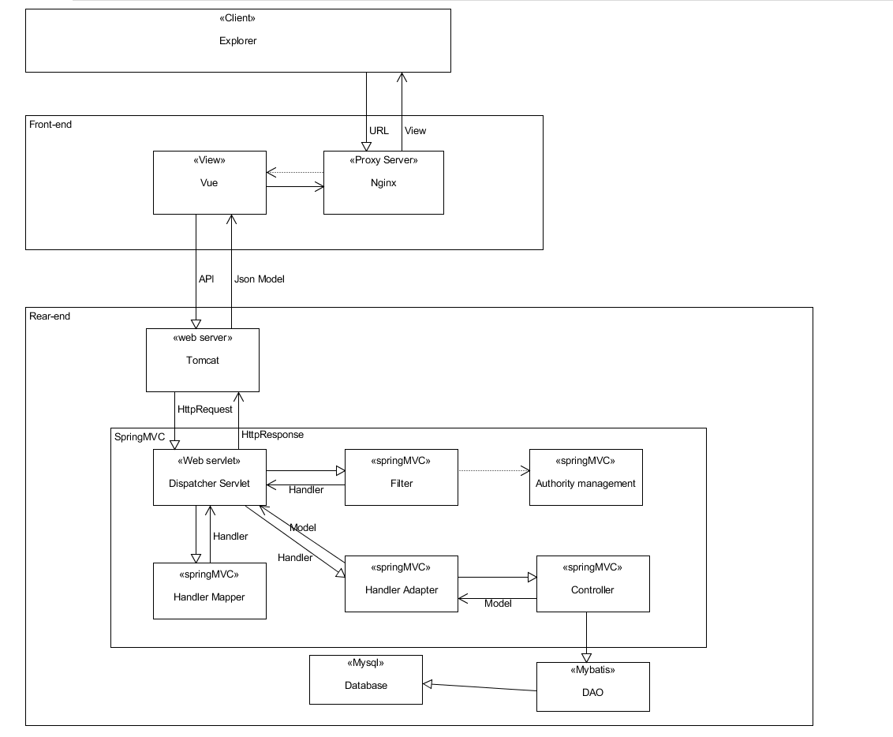
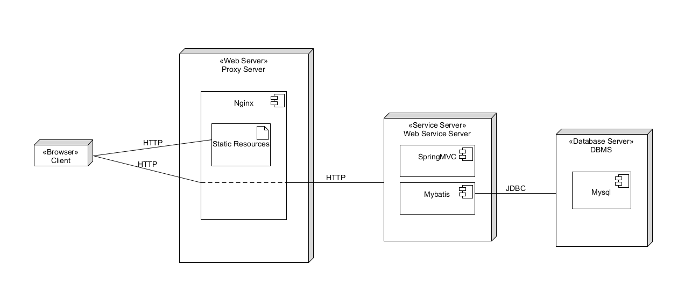

## 1.架构问题
 
(1) 项目选定后端提供RestFul API。问题：商家端需要进行权限验证，Web框架一般采用Cookies+Session来进行身份认证。但RestFul API属于无状态协议，而在后台使用Session的话，由于Session本身需要服务端进行维持，这样就破坏了Rest的无状态性。
 
## 2.解决方案说明

(1) 关于权限认证问题的解决方案：抛弃Cookie+Session的认证架构，选用Token作为认证手段。商家端在登录后，后台收集商家信息、IP、访问时间等信息，生成对应Token，通过cookies传回商家端。之后的每次请求API，都需要带上Token；后台对Token进行解码与鉴权操作。这样就可以在服务端本身不维护登录状态的情况下，进行权限认证，不会破坏RestFul的特性。

## 3.逻辑视图

## 4.物理视图

