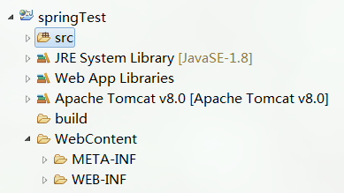

# 术语含义
## 逻辑架构
软件的逻辑架构规定了软件系统由哪些逻辑元素组成、以及这些逻辑元素之间的关系。逻辑架构关注的是功能，包含用户直接可见的功能，还有系统中隐含的功能。或者更加通俗来描述，逻辑架构更偏向我们日常所理解的“分层”，把一个项目分为“表示层、业务逻辑层、数据访问层”这样经典的“三层架构”。

## ECB Pattern
ECB即Entity-Control-Boundary模式，是MVC模式的变种。实体、控制、边界都是类的原型，其中
* Boundary：与外部Actor交互的类。包括 UI、外部系统接口
* Controller：处理外部事件，实现控制流的类。通常是一个子系统、一个用例一个类
* Entity：领域对象或数据实体

# 逻辑架构与框架的映射
以Spring MVC框架为例。Spring web MVC框架提供了MVC(模型 - 视图 - 控制器)架构和用于开发灵活和松散耦合的Web应用程序的组件。 MVC模式导致应用程序的不同方面(输入逻辑，业务逻辑和UI逻辑)分离，同时提供这些元素之间的松散耦合。
* 模型(Model)封装了应用程序数据，通常它们将由POJO类组成。
* 视图(View)负责渲染模型数据，一般来说它生成客户端浏览器可以解释HTML输出。
* 控制器(Controller)负责处理用户请求并构建适当的模型，并将其传递给视图进行渲染。

创建好一个Spring MVC项目后目录如下：

显然，“表示层、业务逻辑层、数据访问层”的逻辑架构与Spring MVC框架是相当吻合的。对于表示层，模板数据是Entities数据的投影，设计为 dto（data transfer object）对象，放入dtos包。对于业务层，则映射到提供业务逻辑的services包，提供获取关联对象的方法。对于数据访问层，则映射为数据操作对象DAO。

# ECB与框架的映射
以Spring MVC框架为例。

Entity是领域对象或数据实体，映射为pojos包。Boundary是与外部Actor交互的类，包括UI、外部系统接口，映射为部分视图模板（如查询表单）。Controller是处理外部事件，实现控制流的类，它与Spring MVC的Controller对象一致，用于处理一类UI事件。
