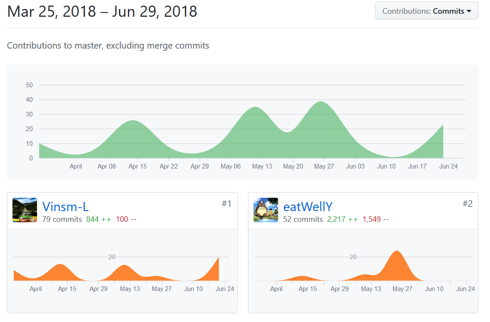
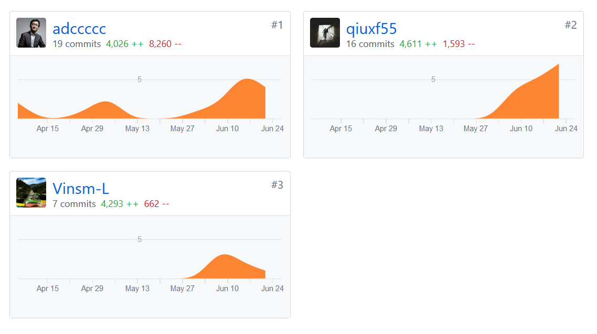

# 自我总结
项目从启动到完成用了3个月的时间，分成初始阶段和4次迭代，在初始阶段完成项目构想、筛选核心用例、完成成员分工以及相关技术的学习，
而后4次迭代就实现前后端分离开发，逐渐往框架填充功能，解决大大小小的bug。我加入的是后端开发，后端采用Spring MVC架构，我的任务主要是实现Controller类、
Service实现类以及测试。现在回顾起来，还有很多可以改进的地方，如提高交流的效率，进度管理应更为严格一些等等。
项目从无到有，感谢大家的付出，感谢后端开发组BC带路，我也从中收获了许多。

# PSP 2.1 统计表

PSP2.1 | Personal Software Process Stages | Time (%)
-|-|-
**Planning** | **计划** |7
·         Estimate|·         估计这个任务需要多少时间|7
**Development**|**开发**|70
·         Analysis|·         需求分析 (包括学习新技术)|10
·         Design Spec|·         生成设计文档|6
·         Design Review|·         设计复审 (和同事审核设计文档)|8
·         Coding Standard|·         代码规范 (为目前的开发制定合适的规范)|6
·         Design|·         具体设计|10
·         Coding|·         具体编码|12
·         Code Review|·         代码复审|8
·         Test|·         测试（自我测试，修改代码，提交修改）|10
**Reporting**|**报告**|23
·         Test Report|·         测试报告|8
·         Size Measurement|·         计算工作量|7
·         Postmortem & Process Improvement Plan|·         事后总结, 并提出过程改进计划|8

# 个人分支的 GIT 统计报告
用户名：Vinsm-L
## Dashboard仓库

## code仓库

# 工作清单
后端开发：实现Controller类、Service实现类、编写测试、编写文档。

# 博客清单
* [项目初期经验总结 & Spring MVC学习笔记 ](https://blog.csdn.net/vinsms/article/details/79932192)
* [RESTful API学习笔记](https://blog.csdn.net/vinsms/article/details/79980638)
* [在IntelliJ IDEA中进行单元测试](https://blog.csdn.net/vinsms/article/details/80858944)
