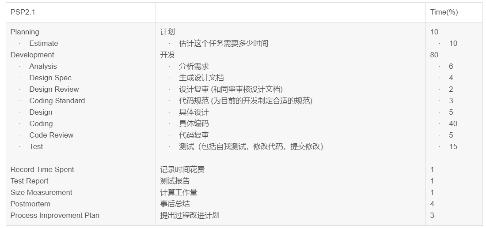
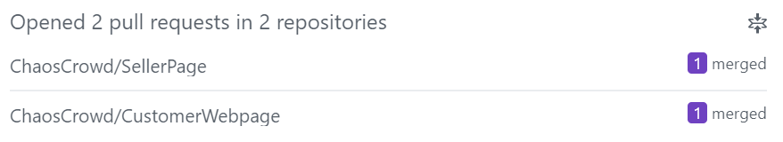
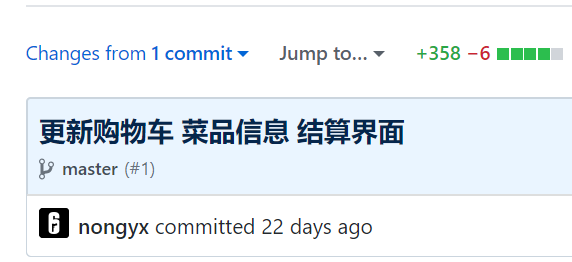
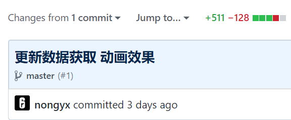
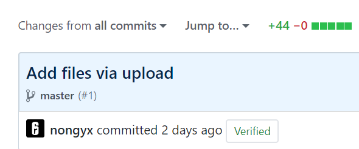

学号：15331245
# 自我总结
本次项目我是中途加入的成员，被分配前端开发的工作。
项目前期的开发进展比较缓慢，在会议讨论上我个人基本在旁听，没有进行过几次发言。之前没有接触过前段开发，因此在确定使用vue之后才开始学习其使用，在eatWellY同学已经编写好的基础页面上一边通过其代码实例进行学习，一边在已经搭好的基础页面框架上进行开发，在这里感谢eatWellY的指导。
总的来说本次项目让我体验到了相较于过往组织性更强的团队开发工作，以及好的项目管理方法和工具对于项目顺利推进的重要性，在这里感谢我的队友能接受我的加入以及对于我的帮助。

# PSP 2.1 统计表

# GIT 统计报告

在前端中顾客端部分的pullrequest记录

商家端部分的pullrequest记录

# 工作清单
前端开发：实现顾客端界面中的购物车、菜品信息及结算界面；实现了几个商家端界面需要使用的对输入数据进行合法性判断的函数。

# 博客清单
* [WINDOWS环境下Tomcat的安装与配置](https://blog.csdn.net/qq_37831598/article/details/79952978)
